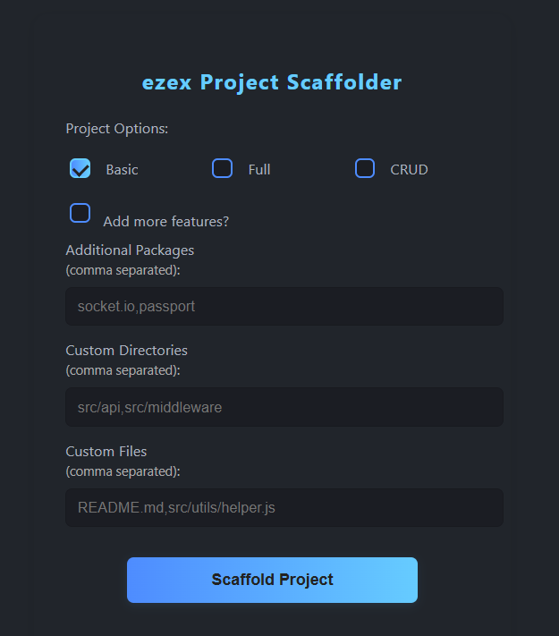
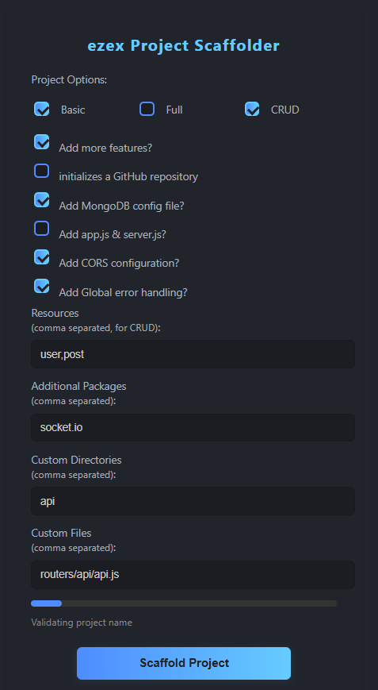
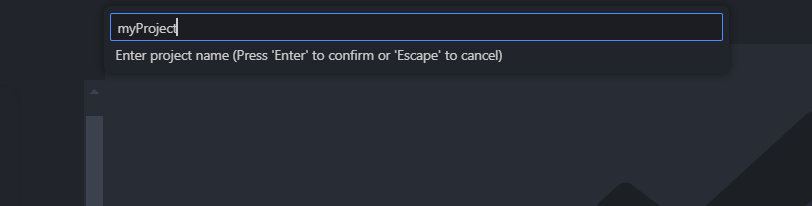
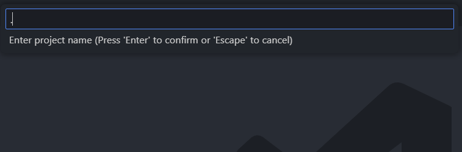
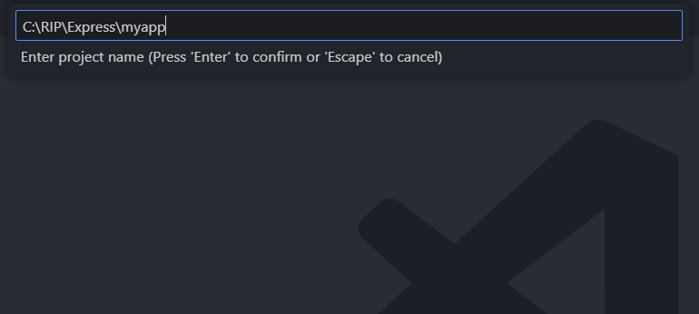
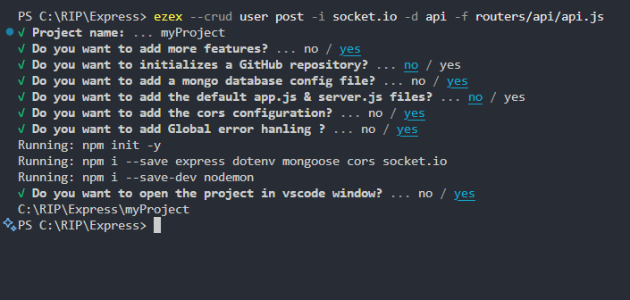

# ezex VS Code Extension

Scaffold Express.js projects in seconds — right from VS Code!

---

## Features

- 🚀 **Project Scaffolding**: Quickly create Express.js projects (Basic, CRUD, Full).
- 🧩 **Customizable**: Add resources, packages, directories, and more.
- ⚡ **Instant Setup**: Automatically opens your new project in VS Code.
- 🖱️ **Easy UI**: No need to remember CLI commands — use the friendly sidebar panel.

---

## Getting Started

### 1. **Install the Extension**

- Search for **ezex** in the VS Code Extensions Marketplace.
- Click **Install**.

### 2. **Usage**

1. Open the **ezex** sidebar from the VS Code activity bar.
2. Fill in your project details:
   - **Project Type** (Basic, CRUD, Full)
   - **Resources** (for CRUD)
   - **Additional Packages**
   - **Custom Directories**
3. Click **Scaffold Project**.
4. Your new project will be created and opened automatically!

---

## Example

1.  

2. Enter just project Name => making sub folder 

3. OR Enter . That mean Here in same folder

4. or Enter the full path  

5.

---

## Why ezex?

- **No more boilerplate**: Start coding instantly.
- **Consistent structure**: Every project is set up the same way.
- **Perfect for teams**: Share and reuse project templates.

---

## Requirements

- [Node.js](https://nodejs.org/)
- [ezex CLI](https://www.npmjs.com/package/ezex) (the extension installs it automatically if needed)

---

## Extension Settings

No additional settings required.  
All options are available in the sidebar UI.

---

## Release Notes

See [CHANGELOG.md](./CHANGELOG.md) for details.

---

## Contributing

Pull requests are welcome!  
For major changes, please open an issue first to discuss what you would like to change.

---

## License

[MIT](./LICENSE)

---

## Links

- [ezex CLI on npm](https://www.npmjs.com/package/ezex)
- [VS Code Marketplace](https://marketplace.visualstudio.com/vscode)
